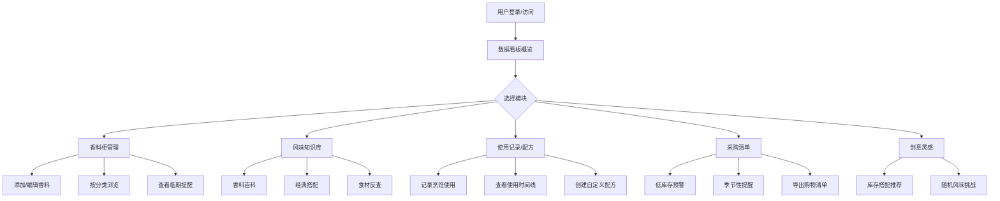

## 1. 产品概述

个人香料柜管理与风味搭配灵感助手，旨在帮助家庭烹饪爱好者科学管理香料库存、探索风味搭配、记录烹饪历程。通过数字化手段解决香料易过期、搭配凭经验、采购无计划等痛点，让每一次烹饪都充满创意与灵感。

- 目标用户：热爱家庭烹饪的美食爱好者、追求风味品质的厨房达人
- 核心价值：库存可视化、搭配科学化、记录可追溯、创意无限化

## 2. 核心功能

### 2.1 功能模块

1. **数据看板**：库存概览、使用统计、临期提醒、搭配排行
2. **香料柜管理**：香料录入、分类展示、照片管理、临期预警、开瓶记录
3. **风味知识库**：香料详情、经典搭配、食材反查、菜系香料配置
4. **使用记录与配方**：烹饪记录、使用时间线、自定义配方、用量统计
5. **采购清单**：低库存预警、季节性提醒、购物清单导出
6. **创意灵感**：库存搭配推荐、随机风味挑战

### 2.2 页面详情

| 页面名称 | 模块名称 | 功能描述 |
|---------|---------|----------|
| 数据看板 | 库存统计卡片 | 展示总数、类别分布、健康度指标 |
| 数据看板 | 月度使用排行 | 柱状图展示Top10常用香料 |
| 数据看板 | 临期香料清单 | 按到期时间排序的紧急使用提醒 |
| 数据看板 | 搭配组合排行 | 展示最常用的香料搭配组合 |
| 香料柜 | 分类筛选栏 | 按类别/位置/形态进行筛选分组 |
| 香料柜 | 香料卡片网格 | 展示照片、名称、剩余量、保质期状态 |
| 香料柜 | 香料录入表单 | 名称、类别、形态、品牌、日期、位置、照片上传 |
| 香料柜 | 香料详情抽屉 | 完整信息、开瓶记录、使用历史、编辑删除 |
| 风味知识库 | 香料百科列表 | 按类别浏览所有香料的基础知识 |
| 风味知识库 | 香料详情页 | 风味特征、常见用途、相性食材、搭配禁忌 |
| 风味知识库 | 经典搭配库 | 牛肉+黑胡椒+迷迭香等预置组合展示 |
| 风味知识库 | 食材反查工具 | 输入食材推荐适配香料组合 |
| 风味知识库 | 菜系香料配置 | 按中餐/西餐/东南亚等分类展示核心香料 |
| 使用记录 | 烹饪记录列表 | 时间线展示每次烹饪的香料使用情况 |
| 使用记录 | 新建记录表单 | 菜品、食材、香料用量、风味评分、备注 |
| 使用记录 | 自定义配方管理 | 创建/编辑混合香料配方、比例、适用菜品 |
| 采购清单 | 低库存预警列表 | 低于阈值的香料，支持按类别批量查看 |
| 采购清单 | 季节性提醒卡片 | 时令前提醒采购季节性香料 |
| 采购清单 | 购物清单导出 | 一键导出为可打印/分享的购物清单 |
| 创意灵感 | 库存搭配推荐 | 基于现有库存推荐可尝试的食材组合 |
| 创意灵感 | 随机风味挑战 | 随机抽取三种库存香料激发创意 |

## 3. 核心流程

### 3.1 主要用户流程

**香料录入流程**：用户进入香料柜 → 点击添加香料 → 填写基础信息（名称、类别、形态） → 填写品牌与日期信息 → 上传瓶身照片 → 设置储存位置与库存阈值 → 保存入库

**烹饪记录流程**：用户完成烹饪 → 新建使用记录 → 录入菜品名称与搭配食材 → 选择使用香料并填写用量 → 进行风味评分 → 保存记录自动更新香料剩余量

**创意探索流程**：用户进入创意灵感 → 系统分析当前库存 → 生成搭配推荐 → 或发起风味挑战获取三种随机香料 → 查看推荐的创意菜谱方向

**采购决策流程**：系统自动检测库存与保质期 → 临期/低库存香料自动入清单 → 用户查看采购清单 → 季节性提醒触发 → 导出清单用于购物

### 3.2 核心流程图

## 4. 用户界面设计

### 4.1 设计风格

- **主色调**：暖棕系（#8B5E3C 深香料棕）搭配鼠尾草绿（#7A9E7E 草本绿），传递自然、温暖、专业的厨房氛围
- **辅助色**：藏红花黄（#E8A838）用于高亮提醒，肉桂红（#C1584F）用于临期预警
- **中性色**：奶油米白（#FDF8F3）背景，炭灰棕（#3D2B1F）文字
- **按钮风格**：微圆角（6px），柔和投影，hover时轻微上浮+颜色加深
- **字体方案**：标题用 Lora 衬线字体传递优雅质感，正文用 Noto Sans SC 确保中文可读性
- **布局风格**：侧边导航 + 主内容区的卡片式布局，每个模块为独立视觉区块
- **图标风格**：Lucide 线性图标，配合香料相关的 emoji 增强识别度

### 4.2 页面设计概览

| 页面名称 | 模块名称 | UI元素设计 |
|---------|---------|-----------|
| 数据看板 | 库存统计卡片 | 四色渐变卡片配数字动画，图标背景圆形色块装饰 |
| 数据看板 | 月度使用排行 | 横向柱状图，柱条渐变填充，hover显示详情 |
| 数据看板 | 临期香料清单 | 红/黄/绿三色状态标签，倒计时天数醒目展示 |
| 香料柜 | 分类筛选栏 | 可滚动标签式筛选器，选中态实心填充 |
| 香料柜 | 香料卡片网格 | 圆角卡片，照片顶部大图，底部信息条，角标显示剩余量进度 |
| 香料柜 | 录入表单 | 分区表单，分组标题，照片上传区域带拖拽效果 |
| 风味知识库 | 经典搭配卡片 | 香料图标环形排列，中间箭头指向目标食材 |
| 风味知识库 | 食材反查工具 | 搜索框+标签云，输入后动态生成推荐组合 |
| 使用记录 | 时间线 | 左侧垂直线，节点为香料图标，卡片错落布局 |
| 创意灵感 | 风味挑战卡片 | 三张翻转卡片，随机抽取动画效果，中央"摇一摇"按钮 |

### 4.3 响应式设计

- **桌面端（默认）**：左侧固定导航栏（240px），主内容区1200px最大宽度，4列香料卡片网格
- **平板端（1024px）**：导航栏折叠为顶部汉堡菜单，3列卡片网格
- **移动端（768px以下）**：底部标签导航，2列卡片网格，表单单列布局，所有触控目标≥44px

### 4.4 交互动效

- 页面切换：淡入 + 轻微上移动画（200ms）
- 卡片悬停：上浮2px + 阴影加深 + 边框颜色微变
- 数据加载：骨架屏占位 + 脉冲动画
- 风味挑战：卡片3D翻转效果（rotateY 180deg）
- 临期提醒：脉冲呼吸动画引起注意
- 进度条：剩余量渐变填充，阈值边界变色
