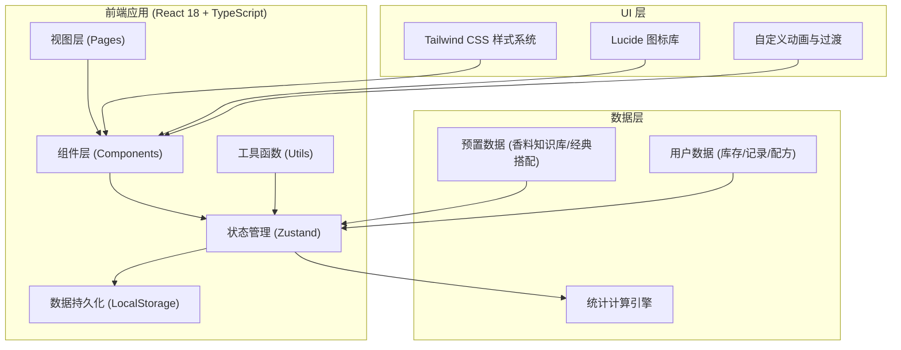
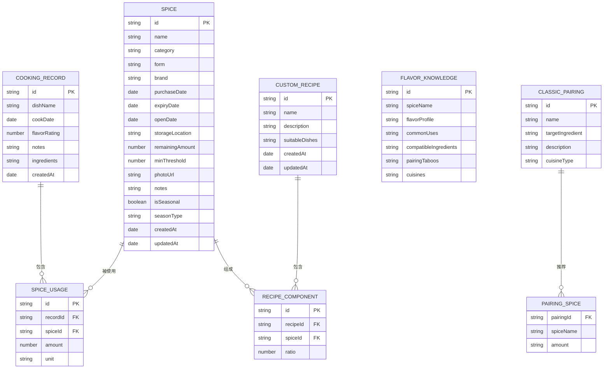

## 1. 架构设计



## 2. 技术选型说明

- **前端框架**：React@18 + TypeScript - 提供类型安全与组件化开发体验
- **初始化工具**：Vite - 极速开发构建工具
- **路由方案**：react-router-dom@6 - SPA页面路由管理
- **状态管理**：zustand - 轻量级状态管理，支持中间件持久化
- **样式方案**：tailwindcss@3 - 原子化CSS，配合自定义设计token
- **图标方案**：lucide-react - 统一线性图标库
- **数据持久化**：localStorage + zustand persist中间件 - 无需后端，纯前端存储
- **图表方案**：纯CSS + SVG自实现（轻量级统计图，避免引入重型图表库）

## 3. 路由定义

| 路由路径 | 页面名称 | 功能说明 |
|---------|---------|----------|
| `/` | 数据看板 | 库存概览、统计图表、临期提醒、搭配排行 |
| `/spice-rack` | 香料柜 | 香料列表、筛选、录入、详情管理 |
| `/knowledge` | 风味知识库 | 香料百科、经典搭配、食材反查、菜系配置 |
| `/records` | 使用记录 | 烹饪记录时间线、新建记录、自定义配方 |
| `/shopping` | 采购清单 | 低库存预警、季节性提醒、导出清单 |
| `/inspiration` | 创意灵感 | 库存搭配推荐、随机风味挑战 |

## 4. 数据模型

### 4.1 数据模型ER图



### 4.2 TypeScript 类型定义

```typescript
// 香料类别
type SpiceCategory = '香草类' | '辛香类' | '辣椒类' | '花香类' | '籽类' | '根茎类' | '混合类';

// 香料形态
type SpiceForm = '整粒' | '粉末' | '新鲜' | '干燥' | '油浸' | '膏状';

// 香料实体
interface Spice {
  id: string;
  name: string;
  category: SpiceCategory;
  form: SpiceForm;
  brand: string;
  purchaseDate: string;
  expiryDate: string;
  openDate?: string;
  storageLocation: string;
  remainingAmount: number; // 0-100 百分比
  minThreshold: number; // 库存预警阈值 0-100
  photoUrl?: string;
  notes?: string;
  isSeasonal?: boolean;
  seasonType?: '春季' | '夏季' | '秋季' | '冬季';
  createdAt: string;
  updatedAt: string;
}

// 香料风味知识
interface FlavorKnowledge {
  id: string;
  spiceName: string;
  category: SpiceCategory;
  flavorProfile: string;
  commonUses: string[];
  compatibleIngredients: string[];
  pairingTaboos: string[];
  cuisines: string[];
}

// 经典搭配
interface ClassicPairing {
  id: string;
  name: string;
  targetIngredient: string;
  spices: { name: string; amount: string }[];
  description: string;
  cuisineType: string;
}

// 烹饪记录
interface CookingRecord {
  id: string;
  dishName: string;
  cookDate: string;
  ingredients: string[];
  usages: { spiceId: string; spiceName: string; amount: number; unit: string }[];
  flavorRating: number; // 1-5
  notes?: string;
  createdAt: string;
}

// 自定义配方
interface CustomRecipe {
  id: string;
  name: string;
  description: string;
  suitableDishes: string[];
  components: { spiceId: string; spiceName: string; ratio: number }[];
  createdAt: string;
  updatedAt: string;
}

// 菜系配置
interface CuisineConfig {
  name: string;
  icon: string;
  coreSpices: string[];
  description: string;
  representativeDishes: string[];
}
```

## 5. 项目结构设计

```
src/
├── components/           # 可复用组件
│   ├── layout/          # 布局组件
│   │   ├── Sidebar.tsx
│   │   ├── Topbar.tsx
│   │   └── PageContainer.tsx
│   ├── spice/           # 香料相关组件
│   │   ├── SpiceCard.tsx
│   │   ├── SpiceForm.tsx
│   │   ├── SpiceDetail.tsx
│   │   └── SpiceFilter.tsx
│   ├── common/          # 通用组件
│   │   ├── StatCard.tsx
│   │   ├── ProgressBar.tsx
│   │   ├── Badge.tsx
│   │   ├── Modal.tsx
│   │   ├── Drawer.tsx
│   │   └── EmptyState.tsx
│   └── charts/          # 图表组件
│       ├── BarChart.tsx
│       ├── PieChart.tsx
│       └── Timeline.tsx
├── pages/               # 页面组件
│   ├── Dashboard.tsx
│   ├── SpiceRack.tsx
│   ├── Knowledge.tsx
│   ├── Records.tsx
│   ├── Shopping.tsx
│   └── Inspiration.tsx
├── store/               # Zustand状态管理
│   ├── useSpiceStore.ts
│   ├── useRecordStore.ts
│   └── useRecipeStore.ts
├── data/                # 预置数据
│   ├── flavorKnowledge.ts
│   ├── classicPairings.ts
│   ├── cuisineConfigs.ts
│   └── mockSpices.ts
├── utils/               # 工具函数
│   ├── dateUtils.ts
│   ├── storageUtils.ts
│   ├── spiceUtils.ts
│   └── exportUtils.ts
├── types/               # 类型定义
│   └── index.ts
├── hooks/               # 自定义Hooks
│   ├── useExpiryAlert.ts
│   ├── useInventory.ts
│   └── useStatistics.ts
├── App.tsx              # 根组件(路由配置)
├── main.tsx             # 入口文件
└── index.css            # 全局样式(Tailwind入口)
```

## 6. 核心算法与业务逻辑

### 6.1 保质期预警算法

```typescript
function getExpiryStatus(expiryDate: string, openDate?: string) {
  const now = new Date();
  const expiry = new Date(expiryDate);
  const daysToExpiry = Math.ceil((expiry.getTime() - now.getTime()) / (1000 * 60 * 60 * 24));
  
  // 开瓶后加速过期（假设开瓶后保质期缩短60%）
  const effectiveDays = openDate 
    ? Math.floor(daysToExpiry * 0.6) 
    : daysToExpiry;
  
  if (effectiveDays <= 0) return { status: 'expired', days: effectiveDays, color: 'danger' };
  if (effectiveDays <= 14) return { status: 'urgent', days: effectiveDays, color: 'warning' };
  if (effectiveDays <= 30) return { status: 'soon', days: effectiveDays, color: 'notice' };
  return { status: 'normal', days: effectiveDays, color: 'success' };
}
```

### 6.2 搭配推荐算法

```typescript
function recommendPairings(availableSpiceIds: string[], targetIngredient?: string) {
  const available = getSpicesByIds(availableSpiceIds);
  let recommendations = [];
  
  // 基于库存的经典搭配匹配度
  for (const pairing of classicPairings) {
    if (targetIngredient && pairing.targetIngredient !== targetIngredient) continue;
    
    const matchedSpices = pairing.spices.filter(s => 
      available.some(a => a.name === s.name)
    );
    const matchScore = matchedSpices.length / pairing.spices.length;
    
    if (matchScore >= 0.5) {
      recommendations.push({
        pairing,
        matchScore,
        matchedSpices,
        missingSpices: pairing.spices.filter(s => 
          !available.some(a => a.name === s.name)
        )
      });
    }
  }
  
  return recommendations.sort((a, b) => b.matchScore - a.matchScore);
}
```

### 6.3 使用频率统计

```typescript
function calculateUsageStatistics(records: CookingRecord[], timeRange: 'month' | 'quarter' | 'year') {
  const spiceUsageCount = new Map<string, number>();
  const pairingFrequency = new Map<string, number>();
  
  const filteredRecords = filterRecordsByDate(records, timeRange);
  
  for (const record of filteredRecords) {
    // 单香料使用计数
    for (const usage of record.usages) {
      spiceUsageCount.set(
        usage.spiceId, 
        (spiceUsageCount.get(usage.spiceId) || 0) + 1
      );
    }
    
    // 香料组合出现频率
    if (record.usages.length >= 2) {
      const combinations = getCombinations(
        record.usages.map(u => u.spiceName), 
        2
      );
      for (const combo of combinations) {
        const key = combo.sort().join(' + ');
        pairingFrequency.set(key, (pairingFrequency.get(key) || 0) + 1);
      }
    }
  }
  
  return {
    topSpices: Array.from(spiceUsageCount.entries())
      .sort((a, b) => b[1] - a[1])
      .slice(0, 10),
    topPairings: Array.from(pairingFrequency.entries())
      .sort((a, b) => b[1] - a[1])
      .slice(0, 5)
  };
}
```
